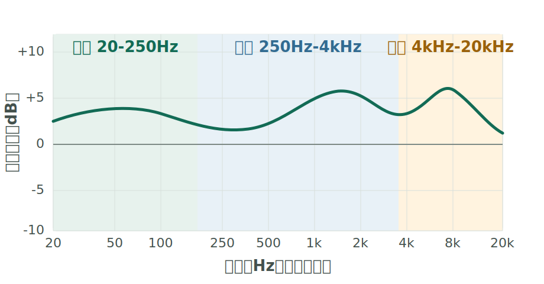
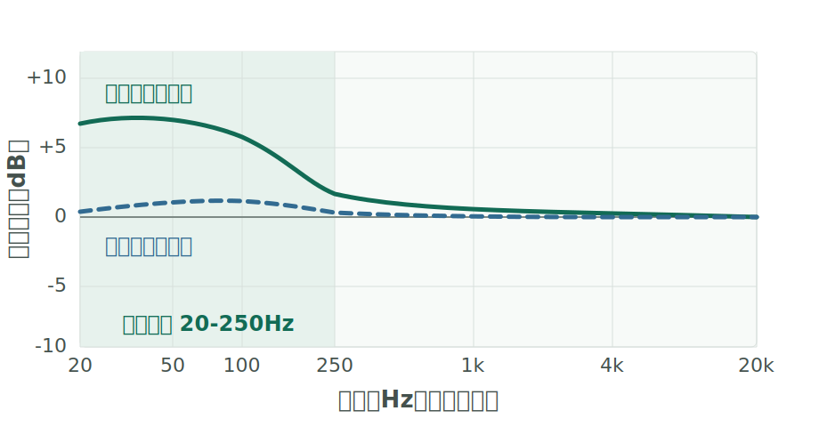
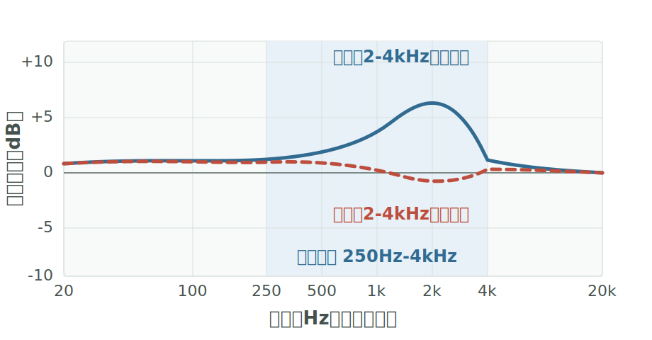
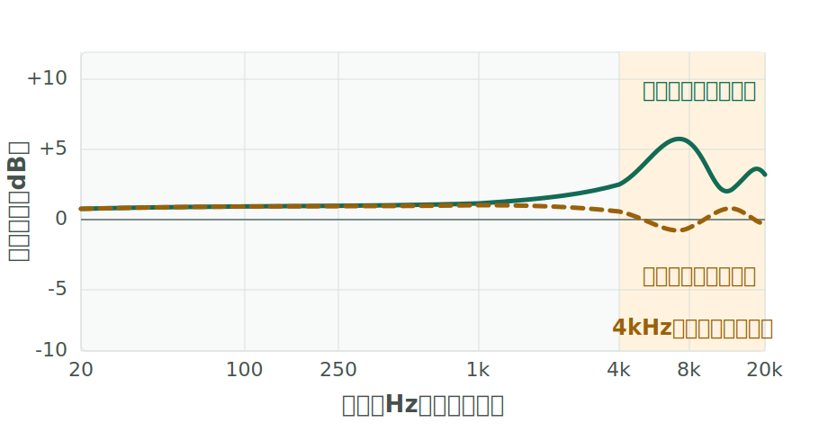
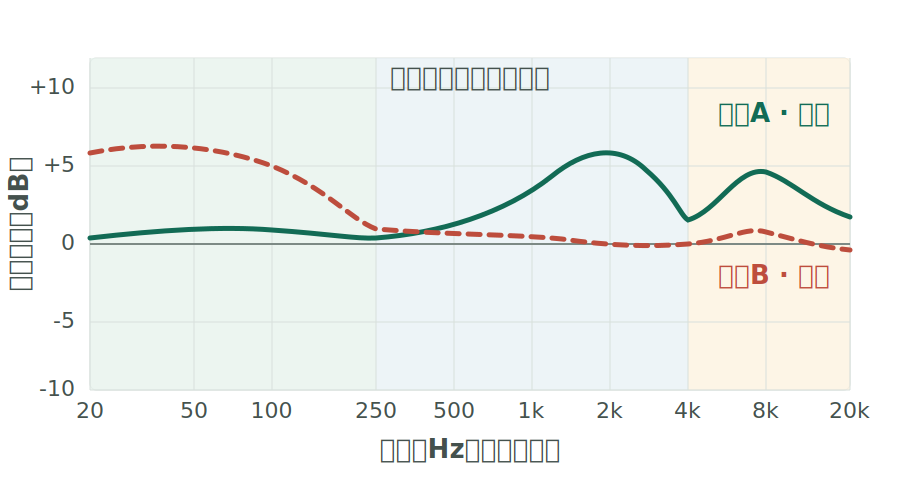

# 频响曲线入门：先看懂，再判断

> **先记一句人话：** 频响曲线是一张“声音配方表”。它告诉你低音、人声和高音谁多一点、谁少一点，不是耳机的总分表。

看曲线的目的不是隔着屏幕判定“谁更高级”，而是先提出一个可试听的猜测：这副耳机可能偏暖、偏亮，还是人声更突出？戴上以后再验证。

---

## 第一步：看懂两根坐标轴

<figure class="frequency-figure">
  
  <figcaption>先认方向：从左到右，声音由低变高；曲线在同一张图里相对更高，通常表示那一段声音更突出。教学示意，非实测数据。</figcaption>
</figure>

- **横轴（Hz，赫兹）**：声音每秒振动多少次。数字小，声音低沉；数字大，声音尖细。横轴采用对数刻度，所以 100 到 1kHz 和 1kHz 到 10kHz 在图上距离相近。
- **纵轴（dB，分贝）**：同一次测量里的相对声压。曲线高几格，不等于耳机整体音量一定更大；它表示这一段相对其他频段更突出。

图里常写 **1k、10k**。这里的 `k` 是一千：`1kHz = 1000Hz`。

<strong>比较前先看图例：</strong>只把同一测量平台、同一补偿方式、同一纵轴比例、同一对齐基准下的曲线放在一起比较。“补偿”是把结果换算到某条参考目标；“对齐”是让两条曲线在同一频率或平均响度上站到同一起点。若网站没有对齐，先比较各自形状，不要直接比绝对高度。测量设备、耳塞套、佩戴深度和密封都会改变结果，8kHz 以上尤其容易波动。

### 为什么“直线”不一定最自然

耳朵、耳道和耳机的佩戴方式都会改变到达鼓膜的声音。因此，耳机频响不是越像水平直线越好。测量网站常放一条 **目标曲线**，它代表这套测量体系下的参考方向；看耳机曲线离目标曲线哪里多、哪里少，比盯着绝对高度更有用。

**目标曲线也不是标准答案。** 它是一个经过研究或调音选择得到的参考，你的耳朵和喜好仍可能不同。

---

## 第二步：先看低频有多少

<figure class="frequency-figure">
  
  <figcaption>实线的低频相对更多，虚线更克制。这里说的是量感差异，不代表哪条一定更好听。</figcaption>
</figure>

先把左边大致分成两块：

- **20-60Hz，超低频**：电子低音、电影轰鸣和大鼓最深的部分。它多时更有“往下沉”的感觉；耳机里通常是耳边的压力感，不等于音箱震胸口的体感。
- **60-250Hz，中低频**：底鼓的冲击、贝斯的主体和声音的厚度。它多时听起来饱满有劲；相对过多时，可能显得轰、闷，并遮住一部分人声。

看低频时问两个问题：最左边有没有明显掉下去？60-200Hz 有没有一大块隆起？前者是 **下潜线索**，后者是 **量感线索**。

密封不严会让低频明显减少，入耳式耳塞尤其如此。试听前先选合适的耳塞套，不然你可能在评价漏气，而不是评价耳机。

> **别误会：** 频响曲线能较好地说明低频有多少、延伸到哪里，却不能单独证明鼓声收得快不快。所谓“干脆还是拖尾”还要结合录音、频响和实际试听。

---

## 第三步：再看人声厚不厚、近不近

<figure class="frequency-figure">
  
  <figcaption>2-4kHz 相对更多时，人声存在感往往更强；距离感仍会受低频、录音和佩戴影响。</figcaption>
</figure>

中频不是一个“人声开关”，可以先这样理解：

- **250Hz-1kHz**：人声和许多乐器的厚度、饱满度。相对多，声音可能更厚更暖；相对少，可能显得薄或空。
- **1-4kHz**：人声咬字、吉他和钢琴的存在感。相对多，人声常更靠前、更清楚；过多时可能显得紧、冲或累。

不要只盯 3kHz 的一个点。人声远近还会受低频遮盖、整段曲线走势、左右声道线索和录音混音影响。曲线只能告诉你“更可能怎样”。

---

## 第四步：最后看高频亮不亮、刺不刺

<figure class="frequency-figure">
  
  <figcaption>高频走势可提供明亮度和刺激感线索。8kHz 以上受测量与佩戴影响很大，不要只凭一个尖峰下结论。</figcaption>
</figure>

- **4-6kHz 左右**：咬字边缘、拨弦起音和部分镲片能量。相对多时更清楚，也可能更锐。
- **6-10kHz 左右**：齿音、镲片亮度和“嘶”“擦”的感觉常在这里出现。哪个位置刺激，会因耳朵和佩戴而不同。
- **10kHz 以上**：常被描述为“空气感”。这一区域的测量最容易变化，只适合看大趋势。

指甲弹玻璃杯的“叮”可以帮助你理解 **偏亮**，弹塑料杯的“笃”可以帮助你理解 **偏暗**。但“亮”不等于解析力高，“暗”也不等于没有细节；有些耳机会把高频抬高，让细节更显眼，却没有还原出更多信息。

---

## 第五步：把两条曲线讲成人话

<figure class="frequency-figure">
  
  <figcaption>教学示意，非具体耳机的实测数据。实线和虚线同时区分两条曲线，避免只靠颜色判断。</figcaption>
</figure>

对这张示意图，可以先作三个猜测：

1. **示例 B 的低频更多**：鼓和贝斯可能更有分量，整体可能更暖。
2. **示例 A 的 2-4kHz 更多**：人声和乐器轮廓可能更靠前。
3. **示例 A 的高频整体更多**：镲片和齿音可能更显眼，也可能更容易疲劳。

注意我们一直在说“可能”。正确用法是：**先看图做预测，再用同一首熟悉的歌、接近的音量去验证。**

---

## 一张图的固定阅读顺序

| 顺序 | 先问什么 | 看哪里 |
|------|----------|--------|
| 1 | 低频是深、厚，还是克制？ | 20-250Hz 的整体形状，以及最左边是否下滑 |
| 2 | 人声可能偏厚、偏薄、靠前还是靠后？ | 250Hz-1kHz 与 1-4kHz 的相对关系 |
| 3 | 声音可能偏亮、偏暗，哪里容易刺激？ | 4kHz 以上的整体趋势，不迷信单个尖峰 |
| 4 | 这张图能和另一张直接比较吗？ | 测量平台、目标/补偿、对齐基准和纵轴比例是否一致 |

---

## 频响曲线不能替你决定什么

频响会明显影响听感，但一张常见的频响图不能独立告诉你：

- 戴着舒不舒服、入耳式能不能密封；
- 做工、耐用性、麦克风和降噪好不好；
- 你对某个高频峰是否敏感；
- 声场、定位、解析力和瞬态到底有多好。

最后四项会受到频响影响，但不能从一条曲线上直接读出结论。把曲线当 **地图**，把试听当 **走一遍这条路**，两者合起来才有用。

---

<nav class="chapter-navigation" aria-label="章节翻页">
  <a href="/hifi-guide/docs/3-listening/soundstage.html">← 3.4 声场</a>
  <a class="chapter-navigation__home" href="/hifi-guide/">返回目录</a>
  <a class="chapter-navigation__next" href="/hifi-guide/docs/3-listening/reference-tracks.html">3.6 参考曲目 →</a>
</nav>
